# Headroom

**A Windows desktop widget that shows how much of your Claude plan you've used, and warns you before you go over.**

[Versión en español](README.md)


> **Unofficial** project. Not affiliated with Anthropic. "Claude" is a trademark of Anthropic.
>
> Formerly called **Cupo**. If you already had it installed, updating keeps your settings, accounts and history.

## What is it for?

Claude plans (Pro, Max, Team…) have limits: a **5-hour session**, a **weekly quota** and, on the Max plan, per-model windows such as **Fable**. claude.ai shows those numbers under *Settings → Usage*, but you have to go and look. Headroom keeps them **always in sight** in a corner of your screen and warns you in time.

It also helps you **spread your weekly quota over the days**: you choose how much you want to use at most per day (for example 14% of the week) and Headroom shows how much you've used today and warns you as you get close.

- **A single account:** see Today, the 5-hour session and the week at a glance, with alerts, history and projection. If you use Claude Code on that same computer, you also see how much of its **context window** each chat has used.
- **Several accounts** (for example personal and work, or accounts on different plans): see **all of them at once**, each with its plan, its bars, its own limits and its own history, together in one window or **each in its own window**. Alerts say which account they're about.

## Examples

The screenshots use **simulated data** (10 days of made-up usage) to show everything it can do. They show the app in Spanish; it's also available in English and three more languages.

### With a single account

**Everything at a glance.** The full view puts together the bars, the Claude Code context window, the history, the breakdown and the projection:

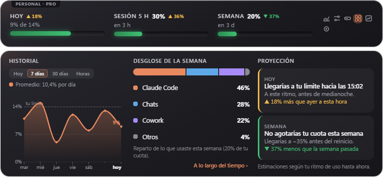

**Dashboard.** Everything at once: the full view plus a row of tiles with your numbers (highest day, average, streak, suggested limit...) and eight charts, each on its own card: today hour by hour, the last 30 days, by day of the week, the day-and-hour map, usage by product (today, this week and week by week) and your busiest hours. It adapts to whatever size you give it:

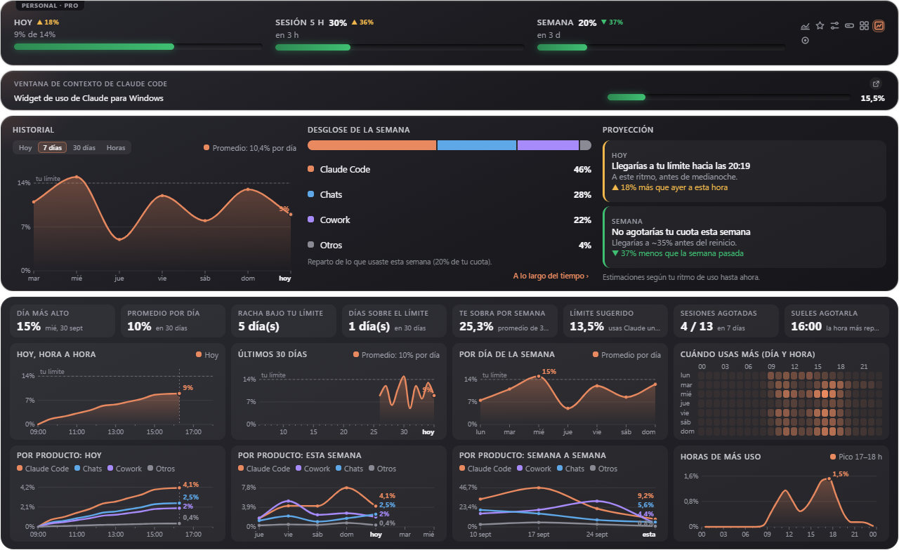

**History as line charts.** Today hour by hour, and the last 7 or 30 days, with your limit marked:

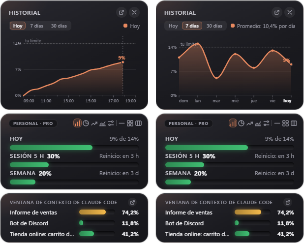

**What time of day you use it most.** The average of each hour of the day, with your peak hour. And next to the week, how you're doing against **last week at this same point** (▼ 12 = you're 12 points below). Panels grow when you drag their edges:

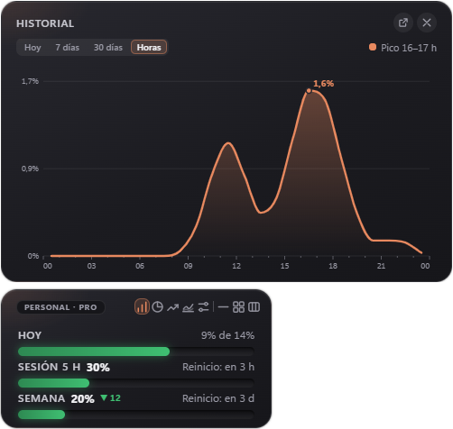

**Usage by product over time.** How much Claude Code, Chats, Cowork and Others used: today, this week (from the day your plan resets), 30 days or week by week:

| This week | Week by week |
| --- | --- |
| 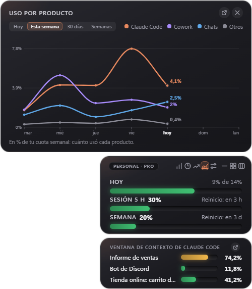 | 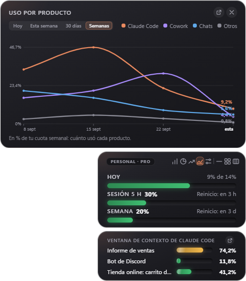 |

**Numbers only.** If you don't want the bars, hide them and the card gets shorter, with the little marks that compare against yesterday, the previous session and last week (▲ more, ▼ less):

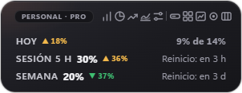

**Whatever size you want.** Minimal (a circle), compact (one line) or horizontal:

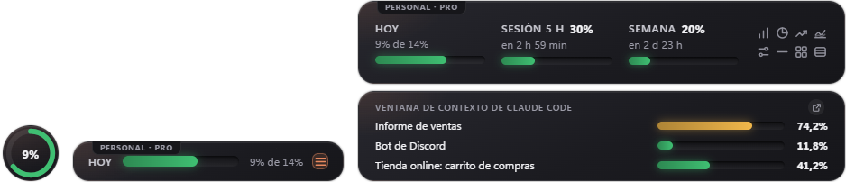

**Each part in its own window.** Move the history, breakdown, projection, usage by product or context window out and place them wherever you like; windows never cover each other:

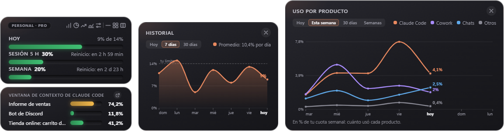

### With several accounts

**All at once**, each with its plan and its bars (plus Fable and extra usage, if it has them):

| Several accounts at once | Accounts panel |
| --- | --- |
|  |  |


**The full view compares the accounts**: one line per account in the history, one bar per account in the breakdown, and each one's projection:


**And the dashboard**, with one line per account in every chart:

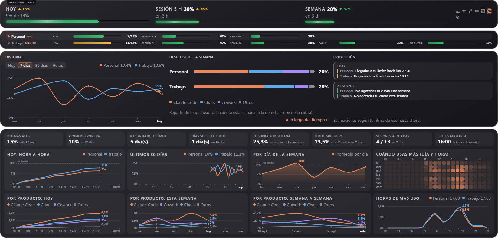

**Or each account in its own window**, to move each one separately:

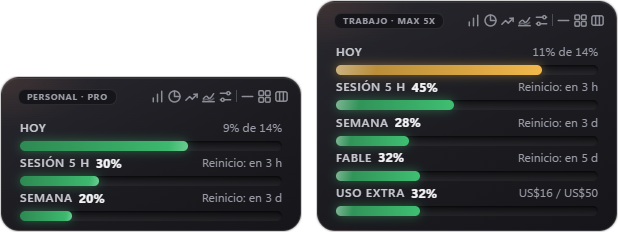

## Features

### What it shows
- **Today:** what you've used today against a **daily limit you set** (it can be different for each weekday), or an **automatic limit** that spreads what's left of your week over the remaining days.
- **5-hour session** and **weekly quota**, with their percentage and **how long until they reset** ("in 2 h 15 min"), or the exact time if you prefer.
- **Max plan:** also the weekly **Fable** window (and any other per-model limit claude.ai reports). It does not appear on Pro.
- **Extra usage:** if you have extra credit enabled with a monthly cap, what you've spent (for example $16 / $50).
- **Plan type** of each account (Pro, Max 5x, Team…).
- **History** as line charts: **today** hour by hour, and the last **7 or 30 days**, with your limit marked and your daily average.
- **Busiest hours:** what time of day most of your quota goes (the average of each hour), with your peak hour.
- **Comparison with last week:** next to the weekly bar, how many points above or below last week you are at this same point. The same for **Today** (against yesterday at this time) and for the **5-hour session** (against the previous session).
- Weekly **breakdown** by product (Claude Code, Chats, Cowork…) and **usage by product over time**: today, this week (from the day your plan resets), 30 days or week by week. On plans with a per-model limit (**Fable**), that limit shows up as one more dashed line.
- **Projection** ("at this pace you'd hit the limit at 6:40 pm").
- **Statistics** from what is already stored: your highest day, your average, your streak under the limit, which weekdays and hours you use it most (a day-by-hour map), how much is left over each week, a suggested daily limit and how many 5-hour sessions you use up. It keeps up to a year of history and can produce a **report** to print or save as PDF.
- With several accounts, the history, breakdown and projection show every account at once.
- **Hover over a bar** to see what it shows.
- **Numbers only** (optional): hides the bars and leaves just the data.
- **Claude Code context window:** how much of its context window each Claude Code chat you used in the last 3 hours (up to 5) has used, so you know when to compact it. See [below](#claude-code-context-window) for when it works.
- **Tray icon** next to the clock that turns green, yellow or red with today's usage.

### Alerts (Windows notifications)
- When you approach and reach your **daily limit**.
- 5-hour session: at the percentage you choose, when it runs out, when it resets and when **at this pace you'd run out** before the reset.
- High **weekly quota** (85% by default), once per week, and when **at this pace you'd use up the week** before the reset.
- **Compact a Claude Code chat** when it reaches the percentage you choose (70% by default), and again every 10% more.
- **Summary** of your day yesterday (when the day starts) and of your week (when it resets).
- **Do not disturb:** mute alerts for 1 hour or until tomorrow from the tray menu.
- **One-click update** when a new version is out: it downloads, installs and reopens by itself.

### Views and look
- **Normal** view (vertical or horizontal), **compact** (one line), **full** (everything at once: bars, history, breakdown and projection) and **Accounts** (all your accounts in rows).
- **Dashboard:** the full view plus the tiles with your numbers and eight charts at once (today hour by hour, 30 days, by day of the week, the day-and-hour map, busiest hours, and usage by product for today, this week and week by week).
- **Minimal:** a small circle with a ring that fills up with today's usage.
- **Each account in its own window** (optional): each one moves separately and has its own view.
- **Parts in their own window:** the history, breakdown, projection, usage by product and context window can be moved out of the widget (button next to the X) and placed wherever you like. With several accounts, each one says which account it belongs to.
- **Windows never overlap:** drop one on top of another and it moves aside and snaps to the edges. Only Settings may cover others while it's open.
- **Resizable windows and panels:** drag the edges of the widget, of an open panel or of a detached part to change its size; text size stays the same and each one remembers its own (double-click an edge to go back to the original size).
- Light, dark or automatic theme, transparency, scale from 70% to 160% and **custom colors** (accent and bar colors).
- **Keyboard shortcut** Ctrl + Alt + C to show or hide it from any program.
- **Show only while Claude is open** (optional): the widget appears when you open the Claude app or Claude Code on that computer, and hides when you close it.
- Export the history to **CSV** (opens in Excel).
- **Backup:** save your settings, accounts and history to a file, and restore them on another computer or after reinstalling Windows. (The backup doesn't include your sign-ins: you sign in to each account again.)

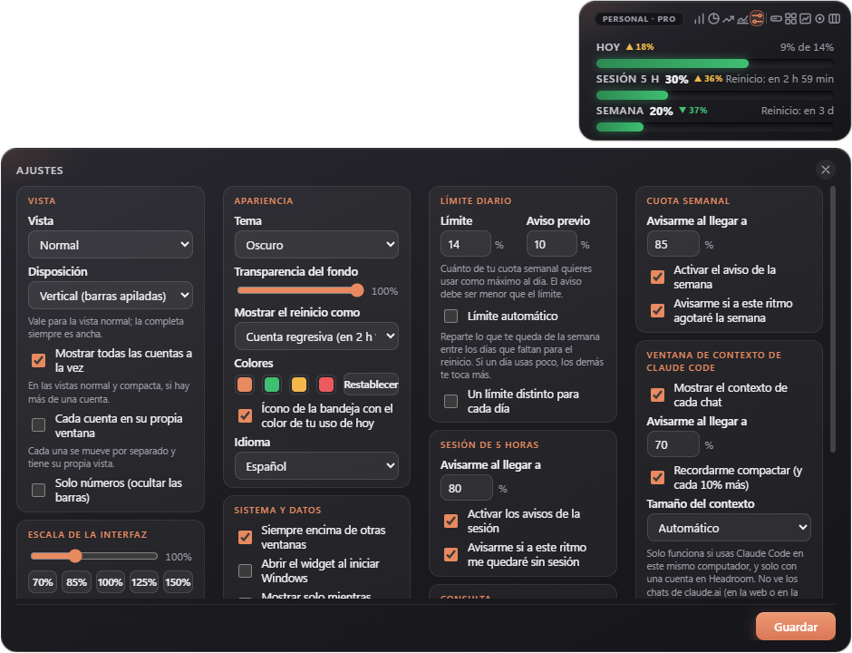

## Claude Code context window

Each Claude Code chat has a "memory" (the context window). When it fills up, the chat gets summarized automatically or you have to start a new one. Headroom shows how full each chat is and reminds you to type `/compact` before it fills up.

- **It only works with Claude Code used on that same computer:** Headroom reads the files where Claude Code stores its chats (`%USERPROFILE%\.claude\projects`). It only looks at the chat's name and how many tokens it has used.
- **It can't see claude.ai chats** (on the web or in the app), because claude.ai doesn't report how much context each conversation uses. It can't see chats from other computers either.
- **It only appears with one account in Headroom.** With several (usually used on different computers) it isn't useful, so it's hidden.
- If you don't use Claude Code, the section simply doesn't appear.

## Languages

Español · English · Português (Brasil) · Français · Deutsch, or **automatic** (the Windows language). Change it in Settings and everything switches instantly: the window, the menu, the alerts and the CSV (with each language's decimal comma or point).

## Install

1. Download `Headroom-Setup-x.y.z.exe` from the [Releases](../../releases) section.
2. Run it. It installs by itself, no administrator rights needed.
3. Windows may show a blue **SmartScreen** warning ("Windows protected your PC") because the installer isn't signed with a paid certificate. Click *More info → Run anyway*. If you'd rather not trust it, all the code is here and you can [build it yourself](#build-it-yourself).
4. The first time, a short welcome explains what everything is. Click **Sign in** and log in to claude.ai as usual.

**To add another account:** click the label with the account name (top left), or the icon next to the clock → Account → **Add account…**. Type a name to recognize it (for example, Work), click **Add** and sign in to claude.ai with that account in the window that opens.

For now there is only a **Windows** version (10 and 11).

## How it works (and what data it touches)

Anthropic doesn't offer an official way to query plan usage, so Headroom does what your browser does: it opens claude.ai in an invisible window **with your own session** and reads the same numbers shown on the *Settings → Usage* page. **It doesn't use up your quota:** it never sends messages to Claude.

- **Your password never goes through Headroom.** Signing in happens on the real claude.ai page.
- Each account keeps its session on your computer, in its own space. Headroom only checks whether the session cookie exists (yes / no); it doesn't read or copy it.
- The only data it saves is your settings and the daily usage percentages, in a local file (`%APPDATA%\widget-uso-claude\datos.json`).
- **Checks every 5 minutes** by default (you can choose 5 to 60; never less than 5, so as not to bother claude.ai). Optionally, **every 2 minutes only while the 5-hour session is above 70%**, which is when timely alerts matter. **While the widget is hidden it doesn't check at all**; when you show it, it updates right away (can be changed in Settings).
- No servers, no accounts, no telemetry. What goes out to the internet: the requests to claude.ai and, once a day, a request to GitHub to check for a new version (can be turned off in Settings). The Claude Code context window only reads files on your computer.

## Honest limitations

- **It can stop working without notice.** It depends on how the claude.ai page is built; if Anthropic changes it, the widget may stop reading usage. Headroom detects this and tells you; the fix lives in a single file (`src/uso.js`).
- "Today's usage" is computed by Headroom: the difference between the current weekly percentage and the one at the start of the day (midnight in your time zone).
- Headroom doesn't count tokens or messages: it shows the percentages that claude.ai reports.
- Make sure your use of this tool is in line with Claude's terms of service. Use at your own risk.

## Build it yourself

You need [Node.js](https://nodejs.org) (version 20 or newer).

```bash
npm install
npm start          # opens the widget
npm test           # tests for the calculations, the context window and the languages
npm run dist       # builds the installer into the dist folder
```

## Layout

```
src/main.js            startup, window, tray, accounts, alerts
src/sesion.js          sign-in (one session per account)
src/uso.js             reads usage from claude.ai  ← the only part that depends on their page
src/calculo.js         daily maths, alerts, projections (no Electron: easy to test)
src/almacen.js         saved data (JSON)
src/actualizaciones.js new version and one-click update (GitHub)
src/contexto.js        context window of Claude Code chats (local files)
src/idiomas/           the texts, one file per language
src/ventanas/          the widget screen (HTML, CSS and JS)
pruebas/               automated tests (npm test)
```

**Adding a language:** copy `src/idiomas/es.js`, translate it and register it in `src/idiomas.js`.

## Contributing

Ideas, bug reports and improvements are welcome: open an issue or a pull request. If the widget stopped reading your usage, an issue with the error message is the most useful thing.

## License

[MIT](LICENSE)
