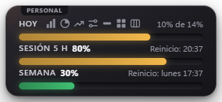
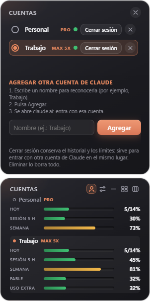
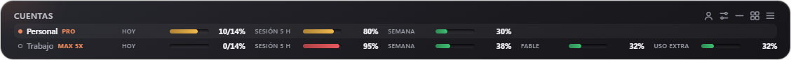
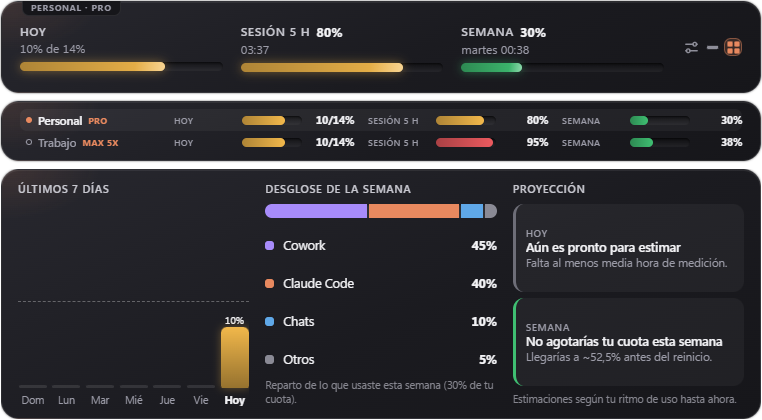

# Cupo

**A Windows desktop widget that shows how much of your Claude plan you've used, and warns you before you go over.**

[Versión en español](README.md)



> **Unofficial** project. Not affiliated with Anthropic. "Claude" is a trademark of Anthropic.

## What it does

- **Three bars always in sight:** *Today* (against a daily limit you set yourself), the *5-hour session* and the *weekly quota*.
- **Warns you** (Windows notifications) when you approach the day's limit, when you reach it, and when the 5-hour session runs out or resets.
- **Several Claude accounts**, each with its own name, limits and history. Switch accounts with one click, or see **all of them at once** ("Accounts" view, stacked normal view, or compact view with one line per account).
- **Plan type** of each account (Pro, Max, Team…) next to its name.
- **Max plan:** also shows the weekly **Fable** window (and any other per-model limit claude.ai reports). It does not appear on Pro.
- **Extra usage:** if you have extra credit enabled with a monthly cap, a bar with what you spent (for example $16 / $50).
- **Weekly quota warning:** a notification when you reach the percentage you choose (85% by default), once per week.
- **Resizable window:** drag the edges to change its shape; text size stays the same.
- **Full view:** 7-day history, breakdown by product (Claude Code, Chats, Cowork…), projection ("at this pace you'd hit your limit at 6:40 pm") and a summary of all your accounts together.
- **A different limit for each weekday**, history export to CSV (opens in Excel).
- **Make it yours:** light / dark / automatic theme, transparency, size from 70% to 160%, normal / compact (one line) / full view, vertical or horizontal layout.
- **Spanish and English** (or follow Windows).
- Lives in the system tray next to the clock, and can start with Windows.

| All accounts at once (with their plan) and the accounts panel | "Accounts" view |
| --- | --- |
|  |  |



## Install

1. Download `Instalar-Cupo-x.y.z.exe` from the [Releases](../../releases) section.
2. Run it. It installs by itself, no administrator rights needed.
3. Windows may show a blue **SmartScreen** warning ("Windows protected your PC") because the installer isn't signed with a paid certificate. Click *More info → Run anyway*. If you'd rather not trust it, all the code is here and you can [build it yourself](#build-it-yourself).
4. The first time, click **Sign in** and log in to claude.ai as usual (Google, email, whatever you use).

## How it works (and what data it touches)

Anthropic doesn't offer an official way to query plan usage, so Cupo does what your browser does: it opens claude.ai in an invisible window **with your own session** and reads the same numbers shown on the *Settings → Usage* page.

- **Your password never goes through Cupo.** Signing in happens on the real claude.ai page.
- The session is stored on your computer, in the app's own space (one per account). Cupo only checks whether the session cookie exists (yes / no); it doesn't read or copy it.
- The only data it saves is your settings and the daily usage percentages, in a local file (`%APPDATA%\widget-uso-claude\datos.json`).
- No servers, no accounts, no telemetry. The only thing that goes out to the internet is the request to claude.ai.

## Honest limitations

- **It can stop working without notice.** It depends on how the claude.ai page is built; if Anthropic changes it, the widget may stop reading usage. Cupo detects this and tells you; the fix lives in a single file (`src/uso.js`).
- Windows only (10 and 11).
- "Today's usage" is computed by Cupo: the difference between the current weekly percentage and the one at the start of the day (midnight in your time zone). If you first open Cupo mid-afternoon, it counts from that moment.
- Cupo doesn't count tokens or messages: it shows the percentages that claude.ai reports.
- Make sure your use of this tool is in line with Claude's terms of service. Use at your own risk.

## Build it yourself

You need [Node.js](https://nodejs.org) (version 20 or newer).

```bash
npm install
npm start          # opens the widget
npm run dist       # builds the installer into the dist folder
```

**Test mode:** `npm start -- --prueba` (or `Abrir widget (modo prueba).bat`) uses made-up data that you control from the tray menu, and stores it in a separate file. Handy to see the alerts without spending your quota.

## Layout

```
src/main.js        startup, window, tray, accounts
src/sesion.js      sign-in (one session per account)
src/uso.js         reads usage from claude.ai  ← the only part that depends on their page
src/calculo.js     daily maths, alerts, projections (no Electron: easy to test)
src/almacen.js     saved data (JSON)
src/idiomas/       the texts, one file per language
src/ventanas/      the widget screen (HTML, CSS and JS)
```

**Adding a language:** copy `src/idiomas/es.js`, translate it and register it in `src/idiomas.js`.

## Contributing

Ideas, bug reports and improvements are welcome: open an issue or a pull request. If the widget stopped reading your usage, an issue with the error message is the most useful thing.

## License

[MIT](LICENSE)
