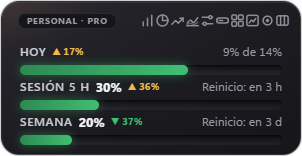

# Cupo

**A Windows desktop widget that shows how much of your Claude plan you've used, and warns you before you go over.**

[Versión en español](README.md)



> **Unofficial** project. Not affiliated with Anthropic. "Claude" is a trademark of Anthropic.

## What is it for?

Claude plans (Pro, Max, Team…) have limits: a **5-hour session**, a **weekly quota** and, on the Max plan, per-model windows such as **Fable**. claude.ai shows those numbers under *Settings → Usage*, but you have to go and look. Cupo keeps them **always in sight** in a corner of your screen and warns you in time.

It also helps you **spread your weekly quota over the days**: you choose how much you want to use at most per day (for example 14% of the week) and Cupo shows how much you've used today and warns you as you get close.

- **A single account:** see Today, the 5-hour session and the week at a glance, with alerts, history and projection.
- **Several accounts** (for example personal and work, or accounts on different plans): see **all of them at once**, each with its plan, its bars, its own limits and its own history. Alerts say which account they're about.

| Several accounts at once | Accounts panel |
| --- | --- |
|  |  |


## Features

### What it shows
- **Today:** what you've used today against a **daily limit you set** (it can be different for each weekday).
- **5-hour session** and **weekly quota**, with their percentage and **how long until they reset** ("in 2 h 15 min"), or the exact time if you prefer.
- **Max plan:** also the weekly **Fable** window (and any other per-model limit claude.ai reports). It does not appear on Pro.
- **Extra usage:** if you have extra credit enabled with a monthly cap, what you've spent (for example $16 / $50).
- **Plan type** of each account (Pro, Max 5x, Team…).
- **History** of 7 or 30 days with your daily average, weekly **breakdown** by product (Claude Code, Chats, Cowork…) and **projection** ("at this pace you'd hit the limit at 6:40 pm").
- **Tray icon** next to the clock that turns green, yellow or red with today's usage.

### Alerts (Windows notifications)
- When you approach and reach your **daily limit**.
- 5-hour session: at the percentage you choose, when it runs out, when it resets and when **at this pace you'd run out** before the reset.
- High **weekly quota** (85% by default), once per week.
- **Do not disturb:** mute alerts for 1 hour or until tomorrow from the tray menu.
- Notice when a **new version** of Cupo is out.

### Views and look
- **Normal** view (vertical or horizontal), **compact** (one line), **full** (everything at once: bars, history, breakdown and projection) and **Accounts** (all your accounts in rows).
- **Resizable window:** drag its edges to change its shape; text size stays the same (double-click an edge to go back to the original size).
- Light, dark or automatic theme, transparency, scale from 70% to 160% and **custom colors** (accent and bar colors).
- **Keyboard shortcut** Ctrl + Alt + C to show or hide it from any program.
- Export the history to **CSV** (opens in Excel).


## Languages

Español · English · Português (Brasil) · Français · Deutsch, or **automatic** (the Windows language). Change it in Settings and everything switches instantly: the window, the menu, the alerts and the CSV (with each language's decimal comma or point).

## Install

1. Download `Instalar-Cupo-x.y.z.exe` from the [Releases](../../releases) section.
2. Run it. It installs by itself, no administrator rights needed.
3. Windows may show a blue **SmartScreen** warning ("Windows protected your PC") because the installer isn't signed with a paid certificate. Click *More info → Run anyway*. If you'd rather not trust it, all the code is here and you can [build it yourself](#build-it-yourself).
4. Click **Sign in** and log in to claude.ai as usual. To add another account: the label with the account name (top left) → **Add**.

For now there is only a **Windows** version (10 and 11).

## How it works (and what data it touches)

Anthropic doesn't offer an official way to query plan usage, so Cupo does what your browser does: it opens claude.ai in an invisible window **with your own session** and reads the same numbers shown on the *Settings → Usage* page. **It doesn't use up your quota:** it never sends messages to Claude.

- **Your password never goes through Cupo.** Signing in happens on the real claude.ai page.
- Each account keeps its session on your computer, in its own space. Cupo only checks whether the session cookie exists (yes / no); it doesn't read or copy it.
- The only data it saves is your settings and the daily usage percentages, in a local file (`%APPDATA%\widget-uso-claude\datos.json`).
- No servers, no accounts, no telemetry. What goes out to the internet: the requests to claude.ai and, once a day, a request to GitHub to check for a new version (can be turned off in Settings).

## Honest limitations

- **It can stop working without notice.** It depends on how the claude.ai page is built; if Anthropic changes it, the widget may stop reading usage. Cupo detects this and tells you; the fix lives in a single file (`src/uso.js`).
- "Today's usage" is computed by Cupo: the difference between the current weekly percentage and the one at the start of the day (midnight in your time zone).
- Cupo doesn't count tokens or messages: it shows the percentages that claude.ai reports.
- Make sure your use of this tool is in line with Claude's terms of service. Use at your own risk.

## Build it yourself

You need [Node.js](https://nodejs.org) (version 20 or newer).

```bash
npm install
npm start          # opens the widget
npm run dist       # builds the installer into the dist folder
```

## Layout

```
src/main.js            startup, window, tray, accounts, alerts
src/sesion.js          sign-in (one session per account)
src/uso.js             reads usage from claude.ai  ← the only part that depends on their page
src/calculo.js         daily maths, alerts, projections (no Electron: easy to test)
src/almacen.js         saved data (JSON)
src/actualizaciones.js new-version notice (GitHub)
src/idiomas/           the texts, one file per language
src/ventanas/          the widget screen (HTML, CSS and JS)
```

**Adding a language:** copy `src/idiomas/es.js`, translate it and register it in `src/idiomas.js`.

## Contributing

Ideas, bug reports and improvements are welcome: open an issue or a pull request. If the widget stopped reading your usage, an issue with the error message is the most useful thing.

## License

[MIT](LICENSE)
